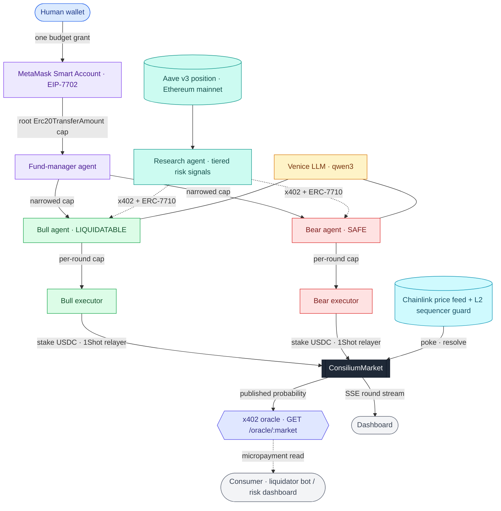

# Consilium

An agent-run liquidation-risk oracle, priced by adversarial agents.

Consilium turns a narrow, fast question into a money-backed signal: will a given Aave v3 position's
collateral cross its liquidation level within a window? Two autonomous agents take opposite sides
(Bull = LIQUIDATABLE, Bear = SAFE). Each one buys tiered on-chain risk signals about the position
(health factor, price headroom, exit liquidity) over x402, reasons over them with Venice, and stakes
USDC on its side. The capital-weighted pot split is a live, money-backed probability of liquidation:
it resolves trustlessly from a Chainlink price feed with the L2 sequencer guard, and consumers such as
liquidator bots or risk dashboards can pay a micropayment over x402 to read it.

Each agent's stake is capped on-chain by a caveat enforcer, so no single agent can move the published
probability beyond its bonded stake. Confidence becomes a costly signal.

Built on Base Sepolia with MetaMask Smart Accounts, x402 + ERC-7710, the 1Shot relayer, Chainlink, and
Venice. Position signals are read from Ethereum mainnet.

## How it works

A round runs in five stages:

1. **One signature, a bounded hierarchy.** A human grants a USDC budget once: a MetaMask Smart Account
   (EIP-7702) signs a root `Erc20TransferAmount` delegation to a fund-manager agent, which redelegates
   narrowed caps to Bull and Bear, which redelegate again to per-round executors. Three levels, and
   each hop can only narrow the cap.
2. **Agents pay agents.** Bull and Bear buy tiered risk signals from the research agent over x402 +
   ERC-7710 (settled through MetaMask's facilitator), paying only for the depth they want.
3. **Reason and stake.** Each agent sizes its stance with Venice, then stakes through the 1Shot
   relayer with gas paid in USDC. The pot split updates the published probability.
4. **Resolve trustlessly.** Anyone pokes the market against the Chainlink feed; once the collateral
   price crosses the liquidation strike within the window it latches, and `resolve()` settles
   LIQUIDATABLE or SAFE, guarded by the L2 sequencer uptime feed. Winners claim pro-rata.
5. **Sell the signal.** The published probability is served over x402 at `GET /oracle/:market`, so a
   consumer pays to read what the agents produced.

The dashboard subscribes to a round over SSE, and every figure on screen links to its on-chain
transaction, feed read, or relayer webhook.

## Architecture



The cap can only narrow at each hop: human, fund-manager, side agent, executor. An over-cap stake
reverts at the `ERC20TransferAmount` caveat enforcer on-chain, not in application code. Resolution and
the published probability never pass through the operator.

## Guarantees

- The published probability cannot be skewed beyond an agent's bonded, on-chain-enforced stake. An
  over-cap stake reverts at the `ERC20TransferAmount` caveat enforcer, three hops from the human
  signature; no application code rejects it, the chain does.
- Resolution is trustless: a Chainlink price feed plus the L2 sequencer guard, not an oracle the
  operator controls.
- Every value shown in the dashboard is backed by an on-chain transaction, a feed read, or a relayer
  webhook.

## Layout

```
packages/contracts/  Foundry. ConsiliumMarket (Chainlink price-cross resolution with the L2 sequencer
                     guard, push-model parimutuel staking), ConsiliumMarketFactory, CUSDC.
packages/shared/     Zod-validated env, chain config with a private/public RPC split, ABIs, and the
                     RoundEvent type union.
packages/agents/     The agents: EIP-7702 smart accounts, the three-level delegation chain, the x402
                     research seller and buyer, the 1Shot relayed stake, Venice reasoning, the live
                     signal reads, the round runner, the SSE event hub, the x402 consumer read
                     endpoint, and Ed25519/JWKS webhook verification.
packages/web/        Next.js dashboard and landing page (RainbowKit, Recharts, Tailwind), driven live
                     over SSE.
```

Uses bun workspaces; contracts are a standalone Foundry project. Smart accounts use EIP-7702, so the
account address is the EOA. Agent reasoning runs on Venice (`qwen3-235b-a22b-instruct-2507`).

## Tests

Contracts (Foundry, offline):

```bash
cd packages/contracts && forge test -vvv
```

Covers price-cross resolution in both directions, latching a cross when the price later recovers, the
L2 sequencer states (down, within grace, past grace), push-model funding (`Unfunded`, `SideMismatch`),
pro-rata claims with a fuzz invariant that total claims never exceed the pot, the factory, and the
over-cap revert backstop.

Agent smoke scripts run against the testnet, relayer, and feed: `keys:status`, `feed:smoke`,
`signals:smoke`, `reasoning:smoke`, `oneshot:smoke`, `x402:smoke`, `delegation:smoke`, `oracle:smoke`,
`demo:overcap`.

## Running it

```bash
# contract tests (offline, no keys)
cd packages/contracts && forge install OpenZeppelin/openzeppelin-contracts smartcontractkit/chainlink-brownie-contracts foundry-rs/forge-std --no-commit && forge test -vvv

# install the workspace
bun install

# smoke a component against the testnet (needs .env; copy .env.example and fill it in)
bun run --filter @consilium/agents feed:smoke
bun run --filter @consilium/agents signals:smoke
bun run --filter @consilium/agents oneshot:smoke

# run a full round end to end
bun run --filter @consilium/agents round:run

# run the demo: the event hub and the dashboard
bun run --filter @consilium/agents events       # http://localhost:8787
cd packages/web && bun run dev                   # http://localhost:3000
```

The round, the hub, and the smoke scripts read configuration from `.env` (throwaway keys funded with a
little Base Sepolia ETH and test USDC, RPC URLs, a Venice key, and the position and feed addresses).
See [.env.example](.env.example).

## Future scope

- **Mainnet.** Move from Base Sepolia to Base mainnet with production USDC, and wire the L2 sequencer
  uptime feed that the contract already guards against.
- **Permissionless markets.** Let anyone open a market on any Aave v3 position through the factory,
  rather than running rounds against a fixed position.
- **Beyond binary.** Generalize the two-sided Bull/Bear market into N agents pricing a range of
  outcomes (for example, time-to-liquidation buckets) on the same parimutuel rails.
- **Richer signals.** Add data sources to the research seller (multi-venue exit liquidity, funding,
  cross-protocol exposure) as additional x402 tiers.
- **Agent reputation.** Track each agent's calibration across resolved rounds and surface a public
  scoreboard, so consumers can weight the published probability by historical accuracy.
- **Oracle distribution.** Offer subscription and streaming access to the x402 oracle, and publish a
  thin on-chain adapter so contracts can consume the probability directly.
- **More protocols.** Extend the position model past Aave v3 to other lending markets and to
  perpetuals, reusing the same resolution and delegation machinery.
